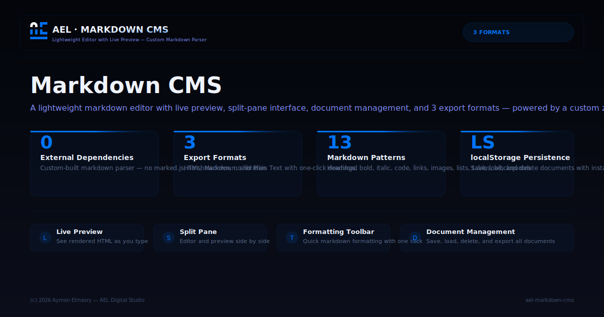

# AEL Markdown CMS

<p align="center">
  
</p>

**A lightweight markdown editor** with live preview, document management, and 3 export formats. Built with a custom markdown parser — zero dependencies.

## Features

- **Live Preview**: See rendered HTML as you type
- **Split Pane**: Editor and preview side by side
- **Toolbar**: Quick markdown formatting (bold, italic, headings, lists, code, links)
- **Document Management**: Save, load, and delete documents (localStorage)
- **Export**: Download as HTML, Markdown, or Plain Text
- **Full Preview**: Dedicated preview section for reading
- **Export All**: Download all documents as a single markdown file
- **Custom Parser**: Handles headings, lists, code blocks, tables, blockquotes, images, links, inline formatting
- **Zero Dependencies**: No marked.js, no showdown, no libraries

## Tech Stack

- **HTML5** — Semantic structure
- **CSS3** — Glassmorphism, split pane, responsive
- **JavaScript** — Custom markdown parser, localStorage, File API

## Live Demo

https://aymanelmasryael.github.io/ael-markdown-cms/

## Usage

### Editor
- Write markdown in the left pane
- See live HTML preview on the right
- Use the toolbar for common markdown syntax
- Save documents with custom titles

### Documents
- All documents are stored in your browser (localStorage)
- Load, edit, and delete saved documents
- Create new documents from scratch

### Export
- **HTML**: Full rendered page with styling
- **MD**: Raw markdown source
- **TXT**: Plain text without formatting

## Supported Markdown

| Syntax | Rendered As |
|--------|-------------|
| `# H1` — `###### H6` | Headings |
| `**bold**` | Bold |
| `*italic*` | Italic |
| `~~strikethrough~~` | Strikethrough |
| `[link](url)` | Link |
| `` | Image |
| `` `code` `` | Inline code |
| ` ``` ``` ` | Code block |
| `- item` | Unordered list |
| `1. item` | Ordered list |
| `> quote` | Blockquote |
| `---` | Horizontal rule |
| `\| table \|` | Table |

## Author

**Ayman Elmasry** — AEL Digital Studio

---

_© 2026 AEL Digital Studio. All rights reserved._
